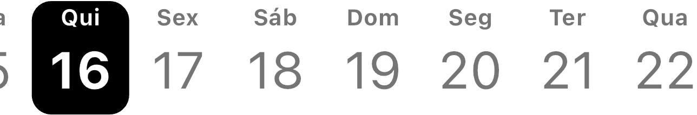

# Timeline Calendar

O **Timeline Calendar** é um pacote Flutter que permite exibir um calendário em formato de linha do tempo, proporcionando uma maneira intuitiva e visualmente atraente de visualizar datas ao longo do mês.



## Características Principais

- Exibição de calendário em formato de linha do tempo.
- Integração fácil e rápida em aplicativos Flutter existentes.

## Instalação

Para instalar o **Timeline Calendar** em seu projeto Flutter, siga estas etapas:

1. Adicione a dependência `timeline_calendar` no arquivo `pubspec.yaml` do seu projeto:

```yaml
dependencies:
  flutter:
    sdk: flutter
  timeline_calendar: ^1.0.0
```

2. Execute o comando `flutter pub get` no terminal para instalar a dependência.

## Uso Básico

```dart
TimelineCalendar(
 initialDate: DateTime.now(),
 firstDate: DateTime.now().subtract(const Duration(days: 365)),
 lastDate: DateTime.now().add(const Duration(days: 365)),
 onDateSelected: (date) => print(date),
 leftMargin: 20,
 activeDayColor: Colors.white,
 disabledColor: Colors.black54,
 activeBackgroundDayColor: Colors.black,
 locale: 'pt',
),
```

## Personalização

Você pode personalizar o **Timeline Calendar** de acordo com suas necessidades. Alguns exemplos de personalização incluem:

- Personalizar o estilo do cabeçalho do calendário.
- Especificar o intervalo de datas a ser exibido.

## FAQ

### Como adicionar eventos ao calendário?

Funcionalidade em desenvolvimento.

### Posso personalizar o estilo do calendário?

Sim, você pode personalizar o estilo do calendário fornecendo suas próprias configurações de estilo aos parâmetros correspondentes do componente `TimelineCalendar`.

## Contribuição

Contribuições são bem-vindas! Sinta-se à vontade para abrir uma issue ou enviar um pull request para sugerir melhorias, correções de bugs ou novos recursos.

## Licença

Este pacote está licenciado sob a [MIT].# flutter_calendar
